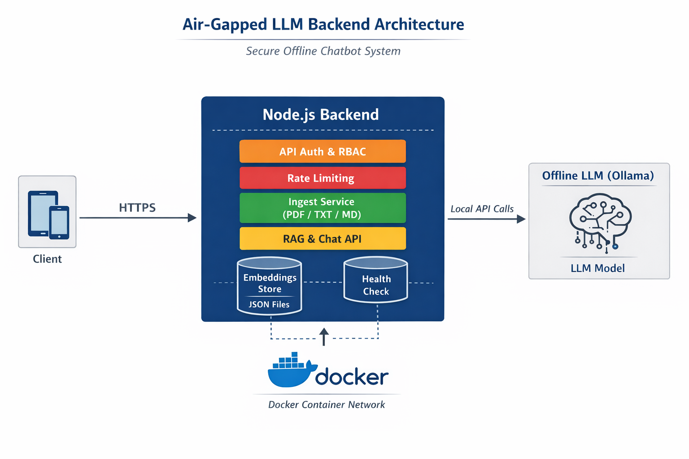

# 🧠 Air-Gapped LLM Backend (Offline Chatbot)

A **production-style Node.js backend** demonstrating how to build and run an **LLM-powered chatbot in a fully air-gapped / offline environment**.

This project is designed to showcase **real backend engineering skills** such as Dockerization, security hardening, API design, and offline AI system integration.

> ❌ No cloud APIs  
> ❌ No OpenAI  
> ✅ Fully offline / intranet-ready

---

## ✨ Key Highlights

- 🔒 Air-gapped by design (offline-first)
- 🤖 Offline LLM using Ollama
- 🔐 HTTPS backend (self-signed TLS)
- 🧱 Dockerized architecture
- 🔑 API-key authentication + RBAC
- 🚦 Manual rate limiting (no external libraries)
- 📄 Secure document ingestion (PDF / TXT / MD)
- 🧠 Basic RAG using file-based embeddings
- 🩺 Health checks & graceful shutdown
- 🛡️ VAPT-aligned security headers

---

## 🏗️ Architecture Overview
<p align="center">
  
  <br/>
  <em>High-level architecture of the air-gapped LLM backend</em>
</p>

**Description:**
- Clients communicate with the backend over HTTPS
- The Node.js backend handles authentication, RBAC, rate limiting, ingestion, and RAG logic
- An offline LLM (Ollama) runs as a separate container
- Embeddings and uploaded files are persisted via Docker volumes
- All services run inside an isolated Docker network suitable for air-gapped environments
```text
Client
↓ HTTPS
Node.js Backend
├── API Versioning (/api/v1)
├── Auth + RBAC
├── Rate Limiting
├── Ingest Service (PDF/TXT/MD)
├── Embedding Store (JSON)
└── Chat API
↓
Ollama (Offline LLM)
```

---

## 📁 Project Structure
```text
├── backend/
│ ├── index.js # HTTPS server bootstrap
│ ├── app.js # Express app configuration
│ ├── routes/
│ ├── controllers/
│ ├── services/
│ ├── middlewares/
│ ├── config/
│ ├── storage/ # RAG embeddings (Docker volume)
│ ├── uploads/ # Uploaded files (Docker volume)
│ ├── Dockerfile
│ └── .env.example
├── certs/ # TLS certificates (not committed)
├── models/
│ ├── Modelfile 
├── docker-compose.yml
└── README.md
```

---

## ⚙️ Tech Stack

- **Backend**: Node.js + Express
- **LLM Runtime**: Ollama (offline)
- **Containerization**: Docker & Docker Compose
- **Storage**: File-based JSON (RAG)
- **Security**:
  - HTTPS
  - API keys
  - RBAC
  - Rate limiting
  - Security headers

---

## 🧩 Prerequisites

- Docker & Docker Compose
- Free ports:
  - `8443` → backend
  - `11434` → Ollama

## 💻 Hardware Requirements

This project is designed to run on **commodity hardware** and does **not require a GPU** for basic usage.

### ✅ Minimum Requirements (Demo / Interview / Learning)

- **CPU**: 4 cores (Intel i5 / Ryzen 5 or equivalent)
- **RAM**: 8 GB
- **Storage**: 15–20 GB free disk space
- **OS**:
  - Linux (recommended)
  - macOS (Intel / Apple Silicon)
  - Windows (via Docker Desktop)
- **Docker**: Docker Engine + Docker Compose

> Suitable for interviews, demos, and local development.

---

### ⚡ Recommended Requirements (Smoother Experience)

- **CPU**: 6–8 cores
- **RAM**: 16 GB
- **Storage**: SSD with 30+ GB free space
- **OS**: Linux / macOS
- **Docker**: Native Docker (not VM-limited)

> Recommended if ingesting multiple documents or running longer LLM prompts.

---

### 🚫 GPU Requirements

- **GPU is NOT required**
- The backend uses **CPU-based inference**
- Ollama runs models in CPU mode by default

> GPU acceleration can be added later but is intentionally avoided to keep the system air-gap friendly.

---

### 🧠 Notes for Air-Gapped Environments

- All models are downloaded **once** and persisted locally
- No internet access is required after initial setup
- Suitable for:
  - Secure networks
  - Intranet deployments
  - Restricted enterprise systems

---

## 🔐 Environment Setup

```bash
cd backend
npm install
cp .env.example .env
```
Set at least:
```env
API_KEY_ADMIN=your-admin-key
API_KEY_READONLY=your-readonly-key
```
---

## 🔑 TLS Certificates (HTTPS)
Generate self-signed certificates for local use:
```bash
mkdir certs

openssl req -x509 -newkey rsa:2048 \
  -keyout certs/key.pem \
  -out certs/cert.pem \
  -days 365 \
  -nodes \
  -subj "/CN=localhost"
```
Certificates are mounted at runtime and never committed.

---
## 🐳 Run with Docker (First Time)
From repository root:
```bash
docker compose build
docker compose up -d
```
---

## 🧠 LLM Model Setup (One-Time)
```bash
docker exec -it ollama ollama create mistral-offline -f /models/Modelfile
```
verify
```bash
docker exec -it ollama ollama list
```
You should see:
```code
mistral
mistral-offline
```
The model is persisted using a Docker volume.

---
## 🩺 Health Check
```bash
curl -k https://localhost:8443/api/health
```
Expected response:
```JSON
{
  "status": "ok"
}
```
Used by Docker health checks.

---
## 🔐 API Usage
Chat API
```bash
curl -k https://localhost:8443/api/v1/chat \
  -H "X-API-Key: <READONLY_OR_ADMIN_KEY>" \
  -H "Content-Type: application/json" \
  -d '{"prompt":"Explain air-gapped systems"}'
```
#
Ingest API (Admin Only)
```bash
curl -k https://localhost:8443/api/v1/ingest \
  -H "X-API-Key: <ADMIN_KEY>" \
  -F "file=@sample.pdf"
```
Supported formats:
- PDF
- TXT
- Markdown

---
## 🔒 Security Design
- Fully offline (no external calls)
- HTTPS with explicit TLS
- API-key authentication
- Role-based access control
- Manual rate limiting
- Centralized error handling
- Security headers (CSP, HSTS, etc.)

---
## 🧠 Why File-Based RAG?
This project intentionally uses JSON-based embeddings instead of a vector database to:
- remain air-gap friendly
- keep the system auditable
- avoid unnecessary infrastructure
- focus on backend fundamentals

Vector databases (FAISS / Qdrant) are natural next steps.

---
## 📌 Interview Talking Points
- Designed for restricted / air-gapped environments
- Immutable Docker image
- Env-driven configuration
- Persistent state via volumes
- Security-first approach
- Clear upgrade path to production scale

---
## 🚧 Future Improvements
- Vector database integration
- Document deduplication
- Streaming chat responses
- Async ingestion pipeline
- Fine-grained audit logging
- Add Proxy in between backend and model
- Non-root Docker container


---
## 📜 License

MIT
